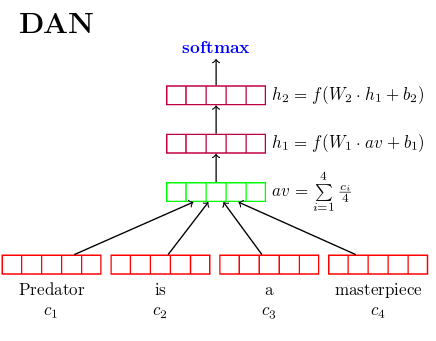
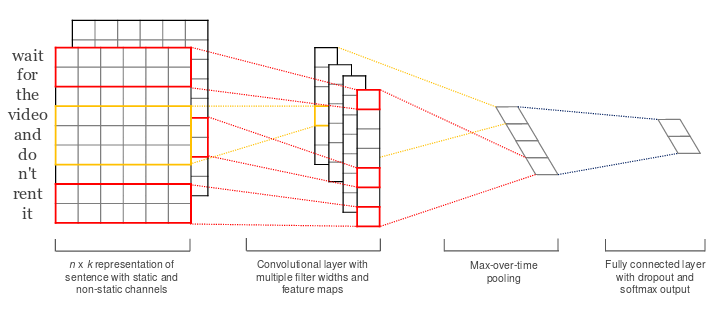
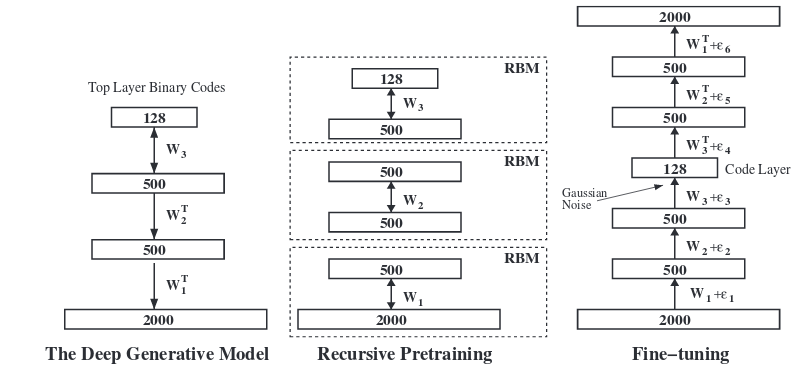
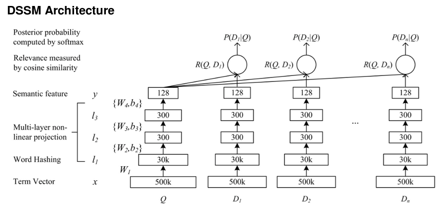

%%%%%%%%%%%%%%%%%%%%%%%%%%%%%%%%%%%%%%%%%%%%%%%%%%%%%%%%%%%%%%%%%%%
%% Some Headers
%%%%%%%%%%%%%%%%%%%%%%%%%%%%%%%%%%%%%%%%%%%%%%%%%%%%%%%%%%%%%%%%%%%

Title: Building Neural Network Models for Information Retrieval
Author: Keith Chewning

%%%%%%%%%%%%%%%%%%%%%%%%%%%%%%%%%%%%%%%%%%%%%%%%%%%%%%%%%%%%%%%%%%%

# Data: Queries
 * Internet search queries 
 * Challenges: 
   - query ambiguity, e.g. baseball strike
   - misspellings, e.g. bleutooth
   - abbreviations, e.g. BSOD, win 8
   - solution ambiguity

%%%%%%%%%%%%%%%%%%%%%%%%%%%%%%%%%%%%%%%%%%%%%%%%%%%%%%%%%%%%%%%%%%%

# Data: Documents
 * Raw HTML pages
 * Challenges
   - Missing page content
   - HTML page "cleaning"
   - Unicode and non-English text

%%%%%%%%%%%%%%%%%%%%%%%%%%%%%%%%%%%%%%%%%%%%%%%%%%%%%%%%%%%%%%%%%%%

# Data: Event Logging
 * Searches
 * Clicks
 * Redirects
 * etc.

%%%%%%%%%%%%%%%%%%%%%%%%%%%%%%%%%%%%%%%%%%%%%%%%%%%%%%%%%%%%%%%%%%%

# Objectives
 * Model-based document retrieval
 * Generalization to answer other questions then just IR
 * Recommendations may be fuzzy 

%%%%%%%%%%%%%%%%%%%%%%%%%%%%%%%%%%%%%%%%%%%%%%%%%%%%%%%%%%%%%%%%%%%

# First Models
Do not forget about the simple things
 * Vector space models and TF-IDF 
 * Latent Semantic Indexing (LSI)

 
Motivation
 * Learn mapping: query space to document space

%%%%%%%%%%%%%%%%%%%%%%%%%%%%%%%%%%%%%%%%%%%%%%%%%%%%%%%%%%%%%%%%%%%

# Moving to Neural Networks

LSI-based models
 * Input: LSI query vector
 * Output: LSI document vector

 
Word2Vec and Doc2Vec
 * Input: word vector averages, query centroid
 * Alternative input: Doc2Vec query vector
 * Output: document vector

 
Challenges 
 * Learning arbitrary vectors

%%%%%%%%%%%%%%%%%%%%%%%%%%%%%%%%%%%%%%%%%%%%%%%%%%%%%%%%%%%%%%%%%%%

# Language Model Architecture Research
Deep Unordered Composition Rivals Syntactic Methods
for Text Classification, Iyyer, et al.

%%%%%%%%%%%%%%%%%%%%%%%%%%%%%%%%%%%%%%%%%%%%%%%%%%%%%%%%%%%%%%%%%%%

# Language Model Architecture Research Continued...
Convolutional Neural Networks for Sentence Classification, Yoon Kim

%%%%%%%%%%%%%%%%%%%%%%%%%%%%%%%%%%%%%%%%%%%%%%%%%%%%%%%%%%%%%%%%%%%

# Challenges with these models
 * Embeddings
   - Use Word2Vec?
 * Classification models
   - What are we classifying, documents?
 * Large number of classes 
   - Potential solution: hierarchical softmax
%%%%%%%%%%%%%%%%%%%%%%%%%%%%%%%%%%%%%%%%%%%%%%%%%%%%%%%%%%%%%%%%%%%

# Prior Research with IR Models
Discovering Binary Codes for Documents by Learning Deep Generative Models,
Hinton, et al.

* Challenges
   - Vocabulary size is too small

%%%%%%%%%%%%%%%%%%%%%%%%%%%%%%%%%%%%%%%%%%%%%%%%%%%%%%%%%%%%%%%%%%%
# Prior Research with IR Models Continued...
Learning Deep Structured Semantic Models for Web Search using Clickthrough Data, Huang, et al.

* Challenges
   - What about weight sharing? 
   - How is a document represented?
   - How is this model used at prediction time?

   
%%%%%%%%%%%%%%%%%%%%%%%%%%%%%%%%%%%%%%%%%%%%%%%%%%%%%%%%%%%%%%%%%%%
# Network Solution
 * Deep stacked autoencoder, similar to the Hinton architecture
 * Deep: multi-layer network
 * Stacked: layer-wise pre-trained
 * Autoencoder: identity function
 * Model input: character hashing
   - robust against abbreviations, misspellings, out of vocabulary words

%%%%%%%%%%%%%%%%%%%%%%%%%%%%%%%%%%%%%%%%%%%%%%%%%%%%%%%%%%%%%%%%%%%
# Network Solution Continued...
 * Fine-tuning after layer-wise pre-training
 * Embedding: a latent semantic representation
 * Vector operations on embeddings
 * Training set: queries 
 * Documents: query context

%%%%%%%%%%%%%%%%%%%%%%%%%%%%%%%%%%%%%%%%%%%%%%%%%%%%%%%%%%%%%%%%%%%
# What types of questions can this type of architecture answer?

 * User query: find other similar queries
 * User query: find most relevant documents
 * Document: find most similar documents
 * Query: document ranking
 * Similarities: use with classification models
 
%%%%%%%%%%%%%%%%%%%%%%%%%%%%%%%%%%%%%%%%%%%%%%%%%%%%%%%%%%%%%%%%%%%
#    &nbsp;&nbsp;&nbsp;&nbsp;&nbsp;&nbsp;&nbsp;&nbsp;&nbsp;&nbsp;&nbsp;&nbsp;&nbsp;&nbsp;&nbsp;&nbsp;&nbsp;&nbsp;&nbsp;&nbsp;&nbsp;&nbsp;&nbsp;&nbsp;&nbsp;&nbsp;&nbsp;&nbsp;&nbsp;&nbsp;&nbsp;&nbsp;&nbsp;&nbsp;&nbsp;&nbsp;&nbsp;&nbsp;&nbsp;&nbsp;&nbsp;&nbsp;&nbsp;&nbsp;&nbsp;&nbsp;&nbsp;&nbsp;&nbsp;&nbsp;&nbsp;&nbsp;&nbsp;&nbsp;&nbsp;

